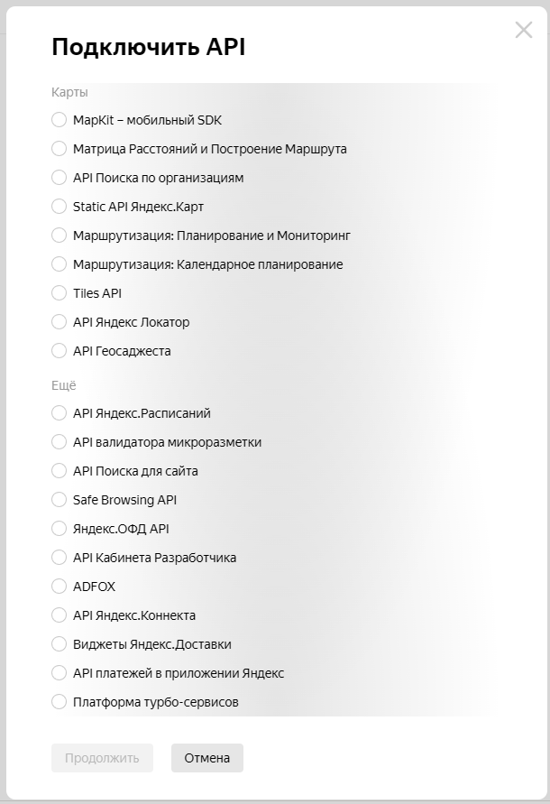

# GeoTransport

`GeoTransport` - это проект на `FastAPI`, использующий `JavaScript API` и `HTTP Геокодер` от `Яндекс` для работы с геолокацией.

Проект включает использование `TailwindCSS` для стилизации и имеет улучшенную структуру для легкой поддержки и расширения.

[JavaScript API и HTTP Геокодер](https://developer.tech.yandex.ru/services/3)



## Создание базового проекта FastAPI

### Установка необходимых пакетов

```bash
# Установите FastAPI и Uvicorn
pip install fastapi uvicorn python-dotenv

# Установите Jinja2 для шаблонов
pip install jinja2

# Установите aiofiles для статических файлов
pip install aiofiles

# Установите необходимые пакеты для работы с запросами
pip install httpx
```

## Структура проекта

```markdown
GeoTransport/
├── app/
│   ├── __init__.py
│   ├── main.py
│   ├── api/
│   │   ├── __init__.py
│   │   └── endpoints.py
│   ├── core/
│   │   ├── __init__.py
│   │   ├── config.py
│   └── templates/
│       └── index.html
├── static/
│   └── styles.css
├── .env
└── requirements.txt
```

## Настройка файла .env

```bash
SECRET_KEY=your-secret-key
YANDEX_API_KEY=your-yandex-api-key
DEBUG=True
```

## Настройка фронтенда и TailwindCSS

### Установка TailwindCSS

```bash
# Установите TailwindCSS через npm
npm install -D tailwindcss
npx tailwindcss init
```

### Конфигурация tailwind.config.js

```
// tailwind.config.js
module.exports = {
  content: ["./app/templates/**/*.html"],
  theme: {
    extend: {},
  },
  plugins: [],
}
```

## Сборка и запуск проекта

### Запуск сборки TailwindCSS

```bash
npx tailwindcss -i ./static/styles.css -o ./static/output.css --watch
```

### Запуск приложения

```bash
uvicorn app.main:app --reload
```


**Автор:** Дуплей Максим Игоревич

**Дата:** 21.12.2024
